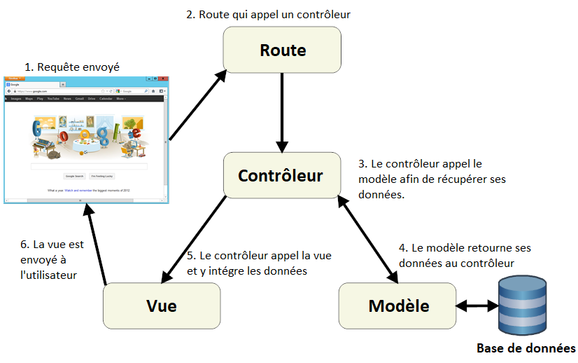
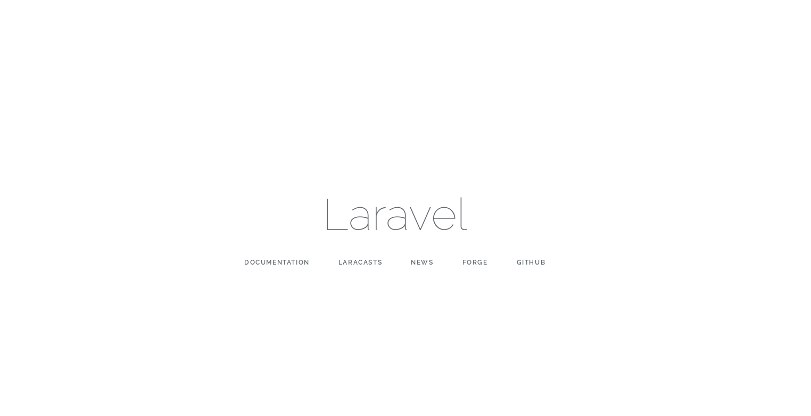
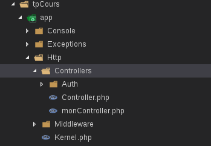

# Cours Laravel

Je vais vous présentez le meilleur framework PHP de TOUS LES TEMPS !!!!!!!

## Présentation générale

Document word...

## Installation de Laravel

Document word...

## Présentation de l'architecture MVC



1. L'internaute transmet une requête en se dirigeant sur le site.
1. La route permet d'appeler un contrôleur.
1. Le contrôleur appelle un modèle (une classe PHP). Le rôle de ce dernier est de récupérer des données (souvent dans la base de données) et d'appeler une (ou plusieurs) vue.
1. Le modèle retourne les données au contrôleur.
1. Le contrôleur appelle la vue et se charger d'intégrer les données dans le HTML.
1. Le HTML final est envoyé à l'utilisateur afin qu'il puisse consulter le site normalement.

## Présentation du Framework PHP Laravel

Laravel est un framework web open-source écrit en PHP respectant le principe de l'architecture MVC et entièrement développé en programmation orientée objet. Laravel est distribué sous licence MIT, avec ses sources hébergées sur GitHub.

*Pour plus d'infos :*

[Wikipédia FR](https://fr.wikipedia.org/wiki/Laravel)

[Wikipédia EN](https://en.wikipedia.org/wiki/Laravel)

## LE TP LARAVEL !!! ON VA ENFIN S'AMUSER ! :smiley:

*Vous dormiez ? :sleeping:*
*Si c'est le cas vous pouvez vous réveillez !*

### Installation de Laravel

A récupérer sur le document word...

Une fois l'installation de Laravel terminée si tout s'est bien passé, en vous rendant sur http://localhost:8000 vous devriez avoir cet affichage :



### Les routes

On se dirige dans le dossier des **routes**


On ouvre le fichier route **web.php**

Ecrivez la ligne

```php
Route::get('/test', 'monController@accueil');
```
Que fait cette ligne ? Elle và appeler le contrôleur **monController** et la function **accueil** de ce contrôleur.

Si on essaye d'accéder à l'adresse `http://127.0.0.1:8000/test`

On a une erreur car le contrôleur n'existe pas encore.
On và donc le créer avec une ligne de commande.

`php artisan make:controller monController`

Les contrôleurs sont créer dans `app` -> `Http` -> `Controllers`



On a bien nôtre nouveau contrôleur **monController.php** dans le dossier `Controllers`