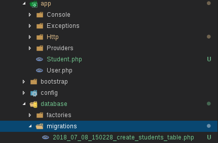
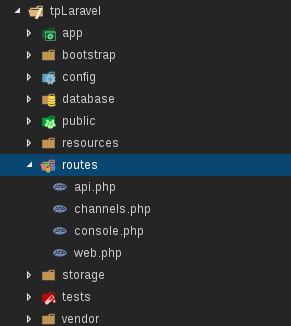
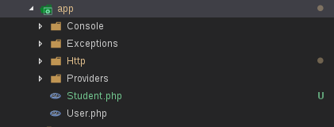

# Cours Laravel

Je vais vous présenter le Framework Laravel, l'un des framework les plus utilisés sur le marché.

## Présentation générale

Document word...

## Présentation de l'architecture MVC


1. L'internaute transmet une requête en se dirigeant sur le site.
1. La route permet d'appeler un contrôleur.
1. Le contrôleur appelle un modèle (une classe PHP). Le rôle de ce dernier est de récupérer des données (souvent dans la base de données) et d'appeler une (ou plusieurs) vue.
1. Le modèle retourne les données au contrôleur.
1. Le contrôleur appelle la vue et se charger d'intégrer les données dans le HTML.
1. Le HTML final est envoyé à l'utilisateur afin qu'il puisse consulter le site normalement.

## Présentation du Framework PHP Laravel

Laravel est un framework web open-source écrit en PHP respectant le principe de l'architecture MVC et entièrement développé en programmation orientée objet. Laravel est distribué sous licence MIT, avec ses sources hébergées sur GitHub.

*Pour plus d'infos :*

[Wikipédia FR](https://fr.wikipedia.org/wiki/Laravel)

[Wikipédia EN](https://en.wikipedia.org/wiki/Laravel)

## LE TP LARAVEL !!! ON VA ENFIN S'AMUSER ! :smiley:

*Vous dormiez ? :sleeping:*
*Si c'est le cas vous pouvez vous réveiller !*

### Installation de Laravel

A récupérer sur le document word...

Une fois l'installation de Laravel terminée si tout s'est bien passé, en vous rendant sur http://localhost:8000 vous devriez avoir cet affichage :


### La base de données

#### Créer la base de données

Il faut se rendre sur phpMyAdmin et créer sa base de données.
(où le faire en ligne de commande si vous préférez. :smirk:)

Donnez lui le nom que vous voulez, moi je vais l'appeler "cours-laravel".

#### Le fichier de configuration

Pour que **Laravel** sache qu'elle base de données vous souhaitez utiliser et qu'il puisse s'y connecter, il faut ouvrir le fichier de configuration .env et le paramétrer.

Ce fichier se trouve à la racine du projet.

*Note: Le fichier ".env" est probablement un fichier caché.*

```
DB_CONNECTION=mysql
DB_HOST=127.0.0.1
DB_PORT=3306
DB_DATABASE=cours-laravel
DB_USERNAME=root
DB_PASSWORD=motDePasse
```
Le champ DB_DATABASE correspond au nom de votre base de données.
Le champ DB_USERNAME correspond à votre identifiant.
Le champ DB_PASSWORD correspond à votre mot de passe.

#### Les migrations

Nous allons maintenant créer une migration avec cette ligne de commande :

`php artisan make:migration create_students_table`

*Note : `create_students_table` est le nom de ma table de migration, vous pouvez l'appeler comme vous le souhaitez.*

Une fois la migration créer, on và l'ouvrir dans le dossier **database** puis dans le dossier **migrations**



Dans notre migration, on a une une fonction "up" :

```php
    public function up()
    {
        Schema::create('students', function (Blueprint $table) {
            $table->increments('id');
            $table->timestamps();
        });
    }
```

Il faut rajouter deux champs un champ *firstname* et un champ *lastname* comme ceci :

```php
    public function up()
    {
        Schema::create('students', function (Blueprint $table) {
            $table->increments('id');
            $table->string('firstname');
            $table->string('lastname');
            $table->timestamps();
        });
    }
```

On peut vérifier les status de nos migrations pour avoir une idée des migrations que l'on a déjà effectuée ou non :

`php artisan migrate:status`

Maintenant, pour pouvoir effectuer la migration on và taper cette ligne de commande :

`php artisan migrate`

Si on refait ici la commande `php artisan migrate:status` on voit bien que maintenant la migration a était effectuée (si il n'y a pas eu d'erreur lors de la commande précédente bien évidemment).

### Les routes

On se dirige dans le dossier des **routes**



On ouvre le fichier route **web.php**

Ecrivez la ligne

```php
Route::get('/', 'MonController@accueil');
```
Que fait cette ligne ? Elle và appeler le contrôleur **MonController** et la function **accueil** de ce contrôleur.

Si on essaye d'accéder à l'adresse `http://127.0.0.1:8000/test`

On a une erreur car le contrôleur n'existe pas encore.
On và donc le créer avec une ligne de commande.

### Le contrôleur

On và écrire cette ligne afin de générer automatiquement le contrôleur.
`php artisan make:controller MonController`

*Note : `MonController` est le nom du controller, vous pouvez l'appeler comme vous le souhaitez.*

Les contrôleurs sont créer dans `app` -> `Http` -> `Controllers`


On a bien nôtre nouveau contrôleur **monController.php** dans le dossier `Controllers`

On và maintenant créer la fonction accueil dans le contrôleur qui affichera `Hello World !` juste pour vérifier que le contrôleur fonctionne correctement.

```php
public function accueil()
{
    echo 'Hello World !';
}
```

Pour respecter l'architecture MVC, le contrôleur appel une vue. Nous allons donc appeler une vue depuis le contrôleur.
La vue que l'on và appeler n'existe pas encore mais on và la créer juste après.

On và remplacer `echo 'Hello World !';` par `return view('hello')';` dans notre fonction accueil du contrôleur **MonController**.

```php
public function accueil()
{
    return view('hello');
}
```
Ainsi on và retourner une la vue "Hello".

### La vue

Pour créer la vue, il faut se rendre dans *app/resources/views* puis créer un fichier *hello.blade.php*.

On và ensuite modifier cette vue et y écrire un petit peu de HTML.

```html
<!DOCTYPE html>
<html lang="en">
    <head>
        <meta charset="UTF-8">
        <meta name="viewport" content="width=device-width, initial-scale=1.0">
        <meta http-equiv="X-UA-Compatible" content="ie=edge">
        <title>Accueil</title>
    </head>
    <body>
        <p>Hello World !</p>
    </body>
</html>
```

On peut tester à nouveau :
[Adresse localhost](http://localhost:8000)

On a bien le message "Hello World !" d'afficher via la vue.

### Le modèle

Pour créer notre modèle qui và se charger de récupérer des données par la suite.

On và écrire dans notre terminal :

`php artisan make:model Student`

*Note : `Student` est le nom du modèle, vous pouvez l'appeler comme vous le souhaitez.*



Maintenant qu'on a créer route, contrôleur et vue, on và pouvoir passer au CRUD !

### Insérer des étudiants dans la BDD

Nous allons insérer des étudiants dans la base de données.

#### Modification du fichier route web.php

Pour insérer des données, on và ajouter une route dans **web.php**

```php
Route::get('/add-student', 'StudentsController@ajout');
```

#### Création d'un contrôleur StudentsController

On và maintenant créer un contrôleur **StudentsController** encore une fois avec la commande :
`php artisan make:controller StudentsController`

Dans ce contrôleur, on và remplacer la ligne
```php
use Illuminate\Http\Request;
```
(qui ne nous sert pas) par
```php
use App\Student;
```
Qui và nous éviter de tomber sur une erreur php...

On và également ajouter une function ajout() qui và permettre d'afficher la page d'ajout des étudiants.

```php
<?php

namespace App\Http\Controllers;

use App\Student;

class StudentsController extends Controller
{
    public function ajout()
    {
        return view('ajoutStudent');
    }
```

### Afficher des étudiants dans la BDD

Nous allons maintenant afficher les étudiants de la base de données.

#### Modification du fichier route web.php

Pour se faire, on và se rendre à nouveau dans le fichier route **web.php** (dans le dossier routes).

Puis on và créer une route qui appel un contrôleur comme ceci :

```php
Route::get('/students', 'StudentsController@afficher');
```

#### Modification du contrôleur StudentsController

On và maintenant de nouveau se rendre dans le contrôleur **StudentsControlleur**

On và y ajouter :

```php
public function afficher()
{
    $students = App\Student::all();


    return view('students', [
        'students' => $students
    ]);
}
```
#### Ajout d'une nouvelle vue et d'un layout

##### Le fichier layout.blade.php

On và créer un fichier **layout** avec **blade** à savoir que blade est un peu l'équivalent de **twig** pour **Symfony**.
Pour se faire on se dirige dans le dossier *resources/views* puis on ajoute un nouveau fichier qu'on và appeler **layout.blade.php**

Dans se fichier on à une grande partie du code HTML que l'on utilise souvent !

```php
<!doctype html>
<html lang="{{ app()->getLocale() }}">
    <head>
        <meta charset="utf-8">
        <meta http-equiv="X-UA-Compatible" content="IE=edge">
        <meta name="viewport" content="width=device-width, initial-scale=1">
        <title>Laravel</title>
    </head>
    <body>
        <div class="container">

            @yield('contenu')
        </div>
    </body>
</html>
```
Le `@yield('contenu')` permet de dire que le contenu sera affiché ici.

##### Le fichier students.blade.php

Nous allons créer une vue **students.blade.php** qui và nous permettre d'afficher nos étudiants.

```php
@extends('layout')

@section('contenu')
<h1>Liste des étudiants</h1>

<ul>
    @foreach($students as $student)
        <li>{{ $student->firstname }} {{ $student->lastname }}</li>
    @endforeach
</ul>
@endsection
```

Avec `@extends('layout')`, on a le fichier code HTML du fichier **layout.blade.php**. C'est un peu comme un `include();` en php.
Ensuite dans `@section('contenu')` on a notre contenu qui est affiché.


##### Modification du modèle Student

Dans notre class Student, on và ajouter une ligne :

```php
class Student extends Model
{
    protected $fillable = ['firstname', 'lastname'];
}

```